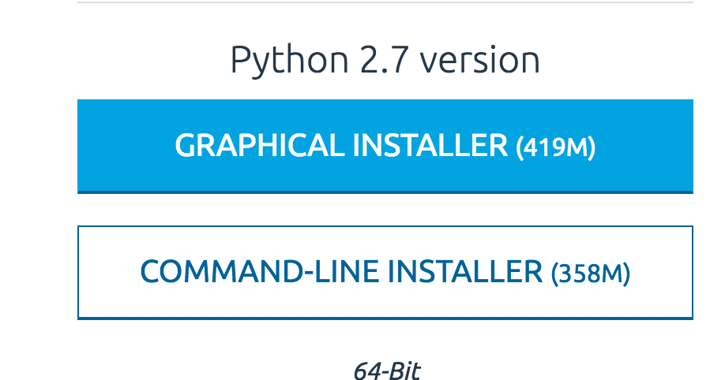

# ActivityRecognition_EOG

### Versions : Python 2.7.13 & anaconda-4.0.0　/ OS: MacOS

## Environmental set up
### python install
<a href="https://www.continuum.io/downloads">Go to the Anaconda Page</a>

Slect the "COMMAND LINE INSTALLER"



then move installed your directroy 
```
$ cd (your directly name)
```

install Anaconda & Python2.7
```
$ bash Anaconda2-4.3.1-MacOSX-x86_64.sh 
```

### OSC module
open the terminal app and move your file directory the install pyOSC 

```
$ pip install pyOSC
```

## How to run
・open the macOSSample.app. connect the J!NS MEME


・Set the movie in Quartz Composer and run


・open the terminal.app


then move your directly

```
$ cd (your directly name)/ResponsiveMedia
```
runing the code

```
$ python demo.py
```